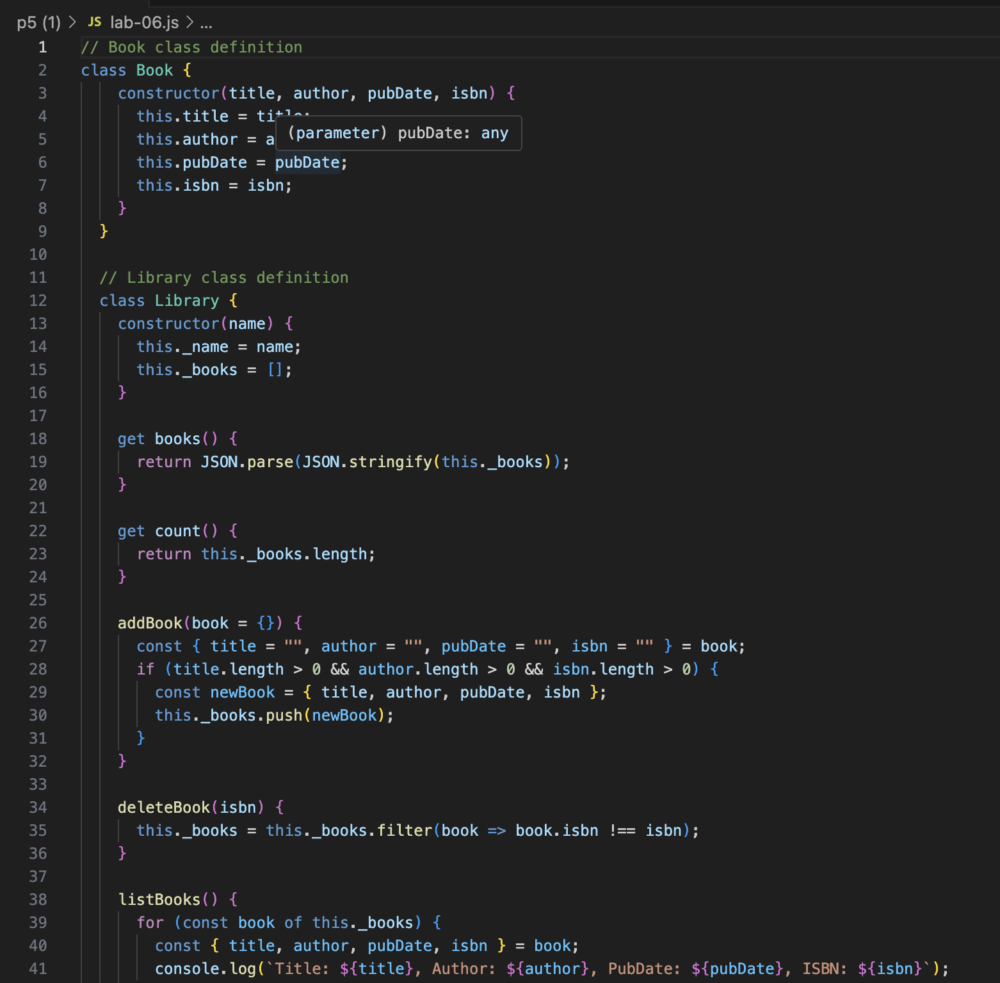
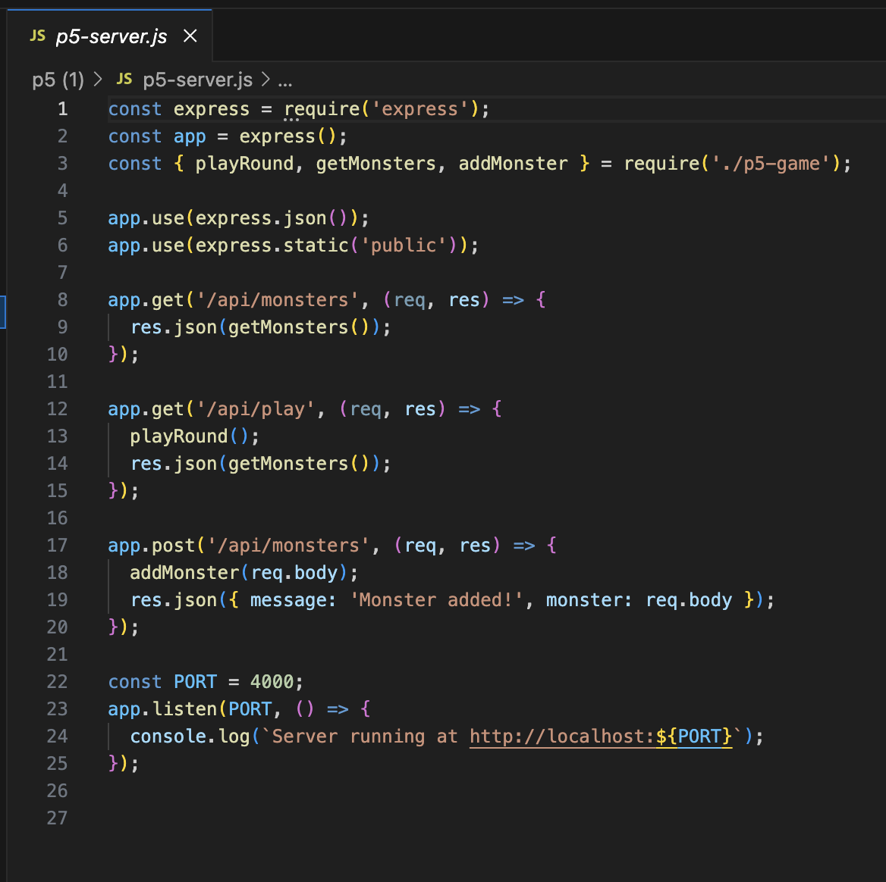

# CIT 281 Project 5

## Lab 6
Purpose: The purpose of this lab was to gain hands-on experience using JavaScript classes to build a simple digital library system by defining class constructors and methods, working with arrays of objects, and managing data through CRUD-like operations.

Technologies: JavaScript, Git, GitHub, VS Code

Learned: I learned how to define and use JavaScript classes and constructors; create and manipulate arrays of objects; simulate private properties and methods; implement add and delete functionality using class methods; and organize and store code using GitHub.

## Project 5
Purpose: The purpose of this project was to create a web-based game using JavaScript classes, a Node.js game module, and an Express server while connecting it to a browser-based client interface for interactive gameplay.

Technologies: JavaScript, Node.js, Express, HTML, CSS, Git, GitHub

Learned: I learned how to structure and use JavaScript classes and methods, work with arrays of objects, organize code using modules, create API routes with Express, send and receive JSON between client and server, and connect a dynamic browser interface to server-side logic.

